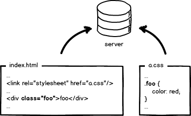

# 静态资源缓存与更新
---
本文将带你深入了解浏览器的缓存机制以及应对策略，请耐心看完。

上图是index.html页面和它的样式文件a.css，用文本编辑器写代码，无需编译，本地预览，确认OK，丢到服务器，等待用户访问。

对于css文件，如果每次用户访问页面都要加载，是不是很影响性能，很浪费带宽啊，我们希望最好这样：

利用304，让浏览器使用本地缓存。但，这样也就够了吗？不成！304叫协商缓存，这玩意还是要和服务器通信一次，我们的优化级别是变态级，所以必须彻底灭掉这个请求，变成这样：

强制浏览器使用本地缓存（cache-control/expires），不要和服务器通信。好了，请求方面的优化已经达到变态级别，那问题来了：你都不让浏览器发资源请求了，这缓存咋更新？

很好，相信有人想到了办法：通过更新页面中引用的资源路径，让浏览器主动放弃缓存，加载新资源。好像这样：

下次上线，把链接地址改成新的版本，就更新资源了不是。OK，问题解决了么？！当然没有！大公司的变态又来了，思考这种情况

页面引用了3个css，而某次上线只改了其中的a.css，如果所有链接都更新版本，就会导致b.css，c.css的缓存也失效，那岂不是又有浪费了？！

重新开启变态模式，我们不难发现，要解决这种问题，必须让url的修改与文件内容关联，也就是说，只有文件内容变化，才会导致相应url的变更，从而实现文件级别的精确缓存控制。

什么东西与文件内容相关呢？我们会很自然的联想到利用 数据摘要要算法 对文件求摘要信息，摘要信息与文件内容一一对应，就有了一种可以精确到单个文件粒度的缓存控制依据了。好了，我们把url改成带摘要信息的：

这回再有文件修改，就只更新那个文件对应的url了，想到这里貌似很完美了。你觉得这就够了么？

现代互联网企业，为了进一步提升网站性能，会把静态资源和动态网页分集群部署，静态资源会被部署到CDN节点上，网页中引用的资源也会变成对应的部署路径：

覆盖式发布静态资源会有一个疑问——先上线页面，还是先上线静态资源？

> 先部署页面，再部署资源：在二者部署的时间间隔内，如果有用户访问页面，就会在新的页面结构中加载旧的资源，并且把这个旧版本的资源当做新版本缓存起来，其结果就是：用户访问到了一个样式错乱的页面，除非手动刷新，否则在资源缓存过期之前，页面会一直执行错误。
>
>先部署资源，再部署页面：在部署时间间隔之内，有旧版本资源本地缓存的用户访问网站，由于请求的页面是旧版本的，资源引用没有改变，浏览器将直接使用本地缓存，这种情况下页面展现正常；但没有本地缓存或者缓存过期的用户访问网站，就会出现旧版本页面加载新版本资源的情况，导致页面执行错误，但当页面完成部署，这部分用户再次访问页面又会恢复正常了。

先部署谁都不成！都会导致部署过程中发生页面错乱的问题。所以，访问量不大的项目，可以让研发同学苦逼一把，等到半夜偷偷上线，先上静态资源，再部署页面，看起来问题少一些。

(以super.css?v=4545这个命名方式，当新的super.css？v=565454上传时会覆盖旧的super.css?v=4545文件，此谓之覆盖式发布)

**如何根本解决这一问题？**

**非覆盖式发布静态资源**
不覆盖旧的静态资源，新旧资源并存。上线过程中，先全量部署静态资源，再灰度部署页面，整个问题就比较完美的解决了

看上图，用文件的摘要信息来对资源文件进行重命名，把摘要信息放到资源文件发布路径中，这样，内容有修改的资源就变成了一个新的文件发布到线上，不会覆盖已有的资源文件。

所以，大公司的静态资源优化方案，基本上要实现这么几个东西：

1. 配置超长时间的本地缓存 —— 节省带宽，提高性能

2. 采用内容摘要作为缓存更新依据 —— 精确的缓存控制

3. 静态资源CDN部署 —— 优化网络请求

4. 更资源发布路径实现非覆盖式发布 —— 平滑升级

[原文地址](https://blog.csdn.net/zhangjs712/article/details/51166748)